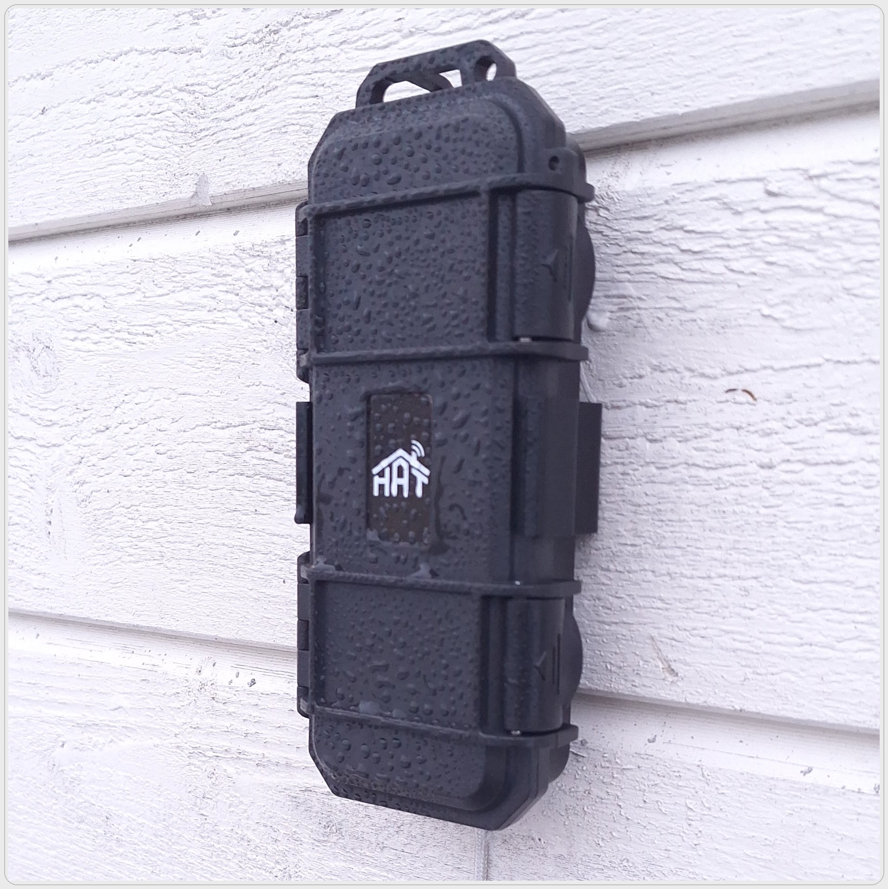

# HAT Geiger Counter

<p align="center">
  <picture>
    <source media="(prefers-color-scheme: dark)" srcset="images/logo-white.png">
    <source media="(prefers-color-scheme: light)" srcset="images/logo-black.png">
    
  </picture>
</p>

<p align="center">
  <a href="https://esphome.io">
    
  </a>
  <a href="https://github.com/homeautomationthings/HAT-Geiger/releases">
    
  </a>
  <a href="LICENSE">
    
  </a>
</p>

<p align="center">
  An outdoor-rated Geiger counter built on the ESP32-C3, designed for seamless
  Home Assistant integration and optional public radiation monitoring via
  <a href="https://radmon.org">radmon.org</a>.
</p>

<p align="center">
  
  &nbsp;&nbsp;
  
</p>

---

## Features

- Measures ionizing radiation in **CPM** and **µSv/hr** using a J321 Geiger tube
- Native **Home Assistant** integration via ESPHome
- **Outdoor rated** — designed for permanent external installation
- Optional automatic upload to **[radmon.org](https://radmon.org)** for public radiation monitoring
- Easy Wi-Fi setup via the **ESPHome mobile app** (BLE) or **USB-C**
- Over-the-air (OTA) firmware updates
- Built-in safe mode recovery for remote troubleshooting

---

## What's in the Box

- HAT Geiger Counter unit
- Mounting hardware

---

## Getting Started

### Requirements

- [Home Assistant](https://www.home-assistant.io/) with the
  [ESPHome add-on](https://esphome.io/guides/getting_started_hassio.html) installed
- ESPHome mobile app ([iOS](https://apps.apple.com/app/esphome/id1564944745) /
  [Android](https://play.google.com/store/apps/details?id=io.esphome.app)) — for initial Wi-Fi setup

### 1. Power the device

Connect the HAT Geiger Counter to power via the USB-C port or the screw terminal (6–12V).

### 2. Provision Wi-Fi

Open the **ESPHome mobile app** and tap **Add Device**. The app will detect the HAT Geiger
Counter via Bluetooth and guide you through entering your Wi-Fi credentials.

Alternatively, connect a USB-C cable to your computer and use the
[ESPHome dashboard](https://esphome.io) to provision via serial.

### 3. Adopt in Home Assistant

Once on your network, the device will appear automatically in Home Assistant under
**Settings → Devices & Services → ESPHome**. Click **Configure** to adopt it.

### 4. (Optional) Set up radmon.org uploads

To contribute your readings to the public radiation monitoring network:

1. Create a free account at [radmon.org](https://radmon.org/index.php/registration)
2. In Home Assistant, open the HAT Geiger Counter device page
3. Enter your **Radmon Username** and **Radmon Password** in the text fields
4. Enable the **Radmon.org Upload** switch

Readings will be submitted every 65 seconds automatically.

---

## Entities

| Entity | Type | Description |
|--------|------|-------------|
| Radiation | Sensor | Radiation level in µSv/hr |
| CPM | Sensor | Raw counts per minute |
| Radmon.org Upload | Switch | Enable/disable radmon.org uploads |
| Radmon Username | Text | Your radmon.org username |
| Radmon Password | Text | Your radmon.org password |
| Radmon Response | Text Sensor | Last response from radmon.org |
| Radmon Last Upload | Text Sensor | Timestamp of last upload |
| WiFi Signal dB | Sensor | Wi-Fi signal strength in dBm |
| WiFi Signal % | Sensor | Wi-Fi signal strength as percentage |
| Uptime | Sensor | Device uptime in hours |
| IP | Text Sensor | Device IP address |
| SSID | Text Sensor | Connected Wi-Fi network |
| FW | Text Sensor | ESPHome firmware version |
| Restart | Button | Soft restart the device |
| Safe Mode Boot | Button | Boot into safe mode for OTA recovery |

---

## Hardware

| Component | Description |
|-----------|-------------|
| MCU | ESP32-C3 (ESP32-C3-WROOM-02U) |
| Geiger tube | J321 |
| Power input | USB-C or 6–36V DC screw terminal |

### Pinout

| GPIO | Function | Direction |
|------|----------|-----------|
| GPIO0 | Pulse indicator LED | Output |
| GPIO4 | Geiger tube HV supply PWM | Output |
| GPIO5 | Geiger pulse (LED trigger) | Input |
| GPIO6 | Geiger pulse (CPM counter) | Input |
| GPIO7 | Geiger pulse (spare) | Input |
| GPIO9 | Boot button | Input |

---

## Customising the Firmware

The ESPHome configuration is fully open source. After adopting the device in Home Assistant,
you can modify the configuration freely. All components have an `id` assigned, making it
easy to extend or override any part of the config using ESPHome
[packages](https://esphome.io/components/packages.html).

To adopt and edit the config manually:

```yaml
packages:
  remote_package:
    url: https://github.com/homeautomationthings/HAT-Geiger
    ref: main
    files: [hat-geiger.yaml]
    refresh: 1d
```

---

## Changelog

See [CHANGELOG.md](CHANGELOG.md) for the full version history.

---

## License

This project is licensed under the MIT License — see [LICENSE](LICENSE) for details.

The ESPHome configuration is open source and free to modify.

---

<p align="center">
  Made with ♥ by <a href="https://github.com/homeautomationthings">Home Automation Things</a>
</p>
